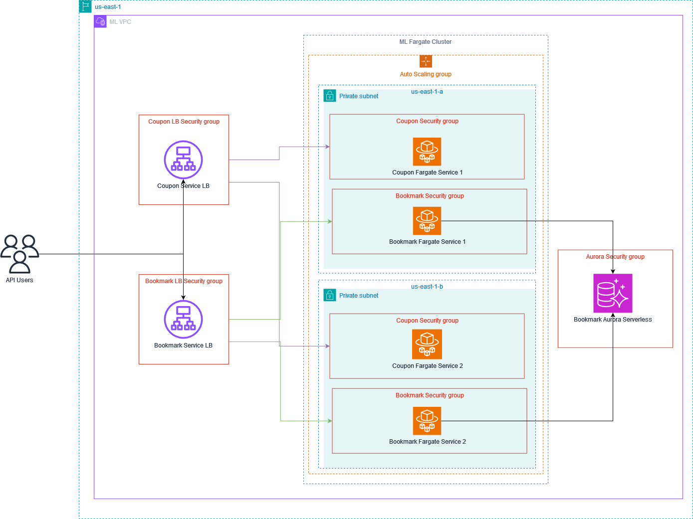

# Mercado Libre Test

## Requirements

* Java 17
* Maven
* Docker
* Docker Compose

## Compile and Run

### Setup

1. Clone the repository.
2. Navigate to the project directory.

### Running the Application

1. Start the Docker containers:

    ```bash
    docker-compose up -d
    ```

2. Navigate to the respective project directory:
    * For Coupon Optimization Project:

        ```bash
        cd coupon
        ```

    * For Top 5 Favorite Items:

        ```bash
        cd bookmark
        ```

3. Build and run the application:

    ```bash
    mvn clean install
    mvn spring-boot:run
    ```

## Testing Endpoints

### Get Top 5 Items

```bash
curl --location --request GET 'http://localhost:8080/coupon/stats'
```

#### AWS:

```bash
curl --location --request GET 'MercadoLibreBookmarkLB-341430534.us-east-1.elb.amazonaws.com/coupon/stats'
```

### Optimize Coupon

```bash
curl --location --request POST 'http://localhost:8081/coupon' \
--header 'Content-Type: application/json' \
--data '{
    "itemIds": [
        "MLA811601010",
        "MLA878620076",
        "MLA1416208901",
        "MLA905560536"
    ],
    "amount": 1000
}'
```

#### AWS:

```bash
curl --location --request POST 'MercadoLibreCouponLB-158385986.us-east-1.elb.amazonaws.com/coupon' \
--header 'Content-Type: application/json' \
--data '{
    "itemIds": [
        "MLA811601010",
        "MLA878620076",
        "MLA1416208901",
        "MLA905560536"
    ],
    "amount": 1000
}'
```

## Deployment

### Architecture


### How Deploy

You can find deployment instructions here:
[Deploy](DEPLOY.MD)